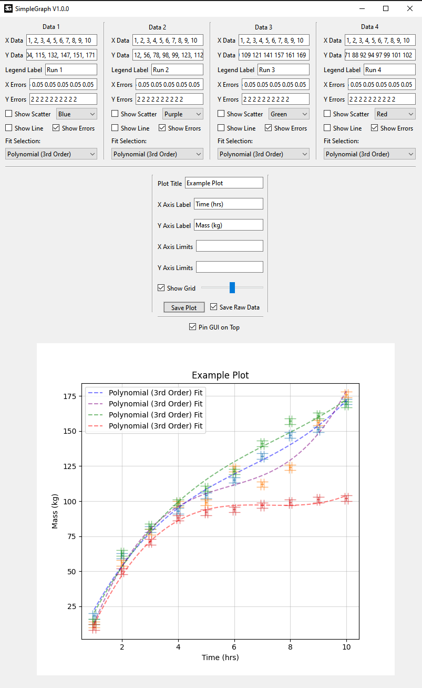
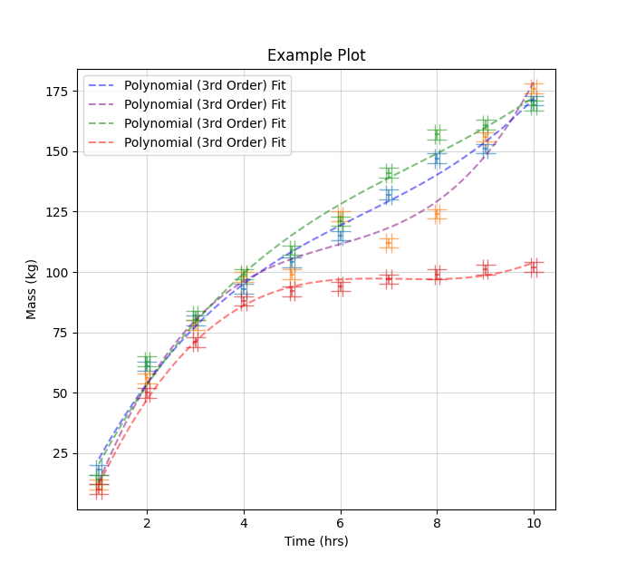

<div align="center">

# SimpleGraph
### Author: Adill Al-Ashgar
#### Simple Windows GUI to create publication ready plots, with no code needed.

 

    - Laboratory quick data analysis
    - Verifying data whilst setting up experiments
    - Quickly creating publication ready plots

[](https://github.com/Adillwma/SimpleGraph)
[](https://www.python.org/) 
[]()
</div>

# Introduction
SimpleGraph is a lightweight data visualization tool written in Python, making use of the matplotlib library for generating plots and PyQt6 for the graphical user interface. It allows users to quickly create plots based on their data and make adjustments to the plot appearance. The program is especially suitable for laboratory settings where users may need to generate plots on the fly for methodology verification. SimpleGraphs ethos is to be as lightweight and simple as possible whilst containing all the necessary features to create publication-ready plots, including error bars and a multitude of fits. This README provides installation instructions and basic usage guidelines for the SimpleGraph application.

# Table of Contents
- [Installation](#installation)
- [Usage](#usage)
- [License](#license)
- [Contributions](#contributions)
- [Contact](#contact)

## Installation
SimpleGraph is primarily developed for Windows users, and we provide a pre-packaged executable for easy installation on Windows. However, it can also be run on other operating systems by executing the Python code directly.

### Windows
To install SimpleGraph on Windows, follow these steps:

1. Download the latest release of SimpleGraph here: [SimpleGraph Download](https://drive.google.com/file/d/1fdBlq7mpX2cDgnVoXMSmi4M9jnS1VNPJ/view?usp=sharing)

2. Run the downloaded SimpleGraph_v1.exe file.

### Other Operating Systems
For users on operating systems other than Windows, you can run SimpleGraph by following these steps:

1. Ensure that you have Python installed on your system. You can download Python from the official website: [Python Downloads](https://www.python.org/downloads/).

2. Open a terminal or command prompt.

3. Install the required Python libraries by running the following commands:

```bash
pip install matplotlib
pip install PyQt6
```

4. After successfully installing the necessary libraries, you can execute SimpleGraph by running the Python script.

```bash
python SimpleGraph.py
```

## Usage
To use SimpleGraph:

1. Open the application.

2. Manually enter your data, either by typing it directly into the interface or by loading it from a file.

3. Customize your plot by adjusting various plotting settings, such as axis labels, titles, and plot types.

4. Click the "Generate Plot" button to create your graph.

5. Save the plot as an image file (e.g., PNG) by clicking the "Save Plot" button.

It's important to note that SimpleGraph is not intended to replace more advanced plotting software like Origin, Matlab, or creating custom Python plots for complex data visualization tasks. Instead, it aims to provide a quick and simple solution for basic data plotting and may be just what you need.

<div align="center">
 

</div>


<div align="center">
 

</div>


# License
This project is not currently licensed. Please contact for more information.

# Contributions
Contributions to this codebase are welcome! If you encounter any issues, bugs or have suggestions for improvements please open an issue or a pull request on the [GitHub repository](https://github.com/Adillwma/SimpleGraph).

# Contact
For any further inquiries or for assistance in running the simulation, please feel free to reach out to me at adill@neuralworkx.com.


